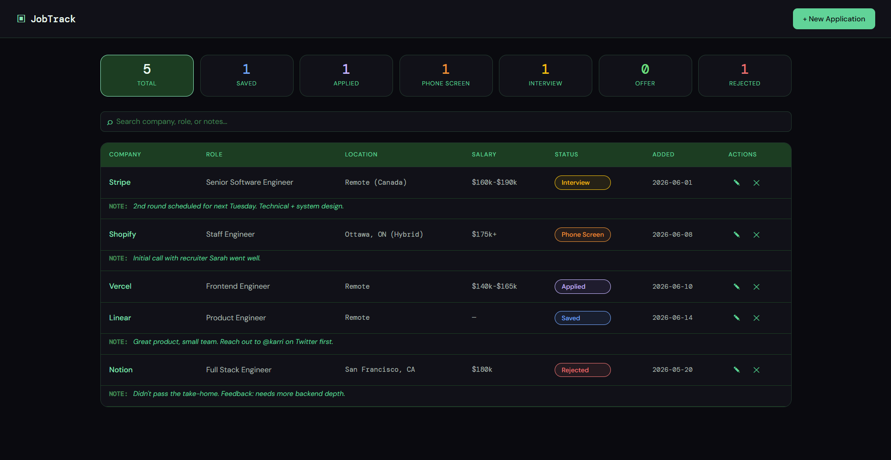
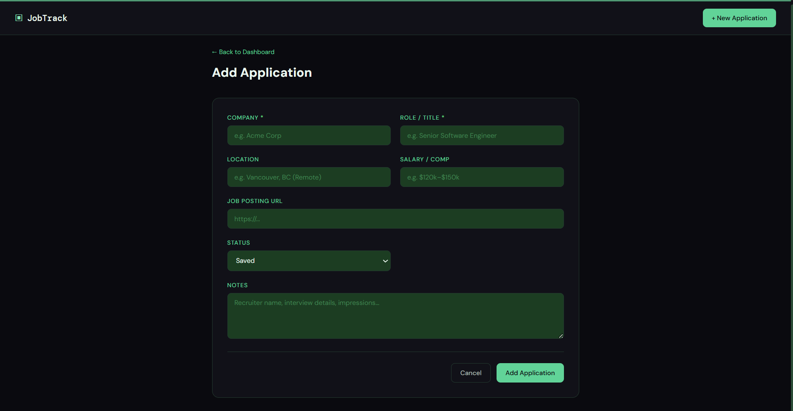
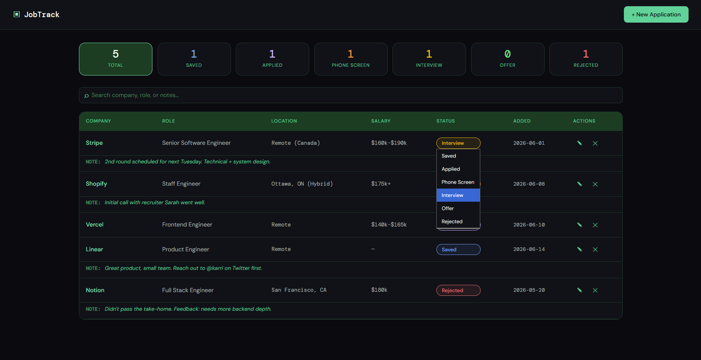

# JobTrack — Job Application Tracker

A Flask-based job tracking application that allows users to store, update, and manage job applications with status tracking and notes.

## Features
- Add, edit, and delete job applications
- Track status: Saved → Applied → Phone Screen → Interview → Offer / Rejected
- Update status inline via the dashboard dropdown
- Filter by status with one click; search across company, role, and notes
- Live stats bar showing counts by stage
- Data stored locally in `jobs.json` (no database needed)

## Tech Stack
- Python
- Flask
- JSON (data storage)
- HTML/CSS

## Screenshots

### Dashboard




## Setup

```bash
# 1. Install dependencies
pip install -r requirements.txt

# 2. Run the app
python app.py

# 3. Open in browser
http://127.0.0.1:5000
```

## Project Structure

```
job-tracker/
├── app.py              # Flask routes & logic
├── jobs.json           # Data file (auto-created)
├── requirements.txt
├── static/
│   └── css/
│       └── style.css   # Green theme styling
└── templates/
    ├── base.html       # Shared layout
    ├── index.html      # Dashboard
    └── form.html       # Add / Edit form
```

